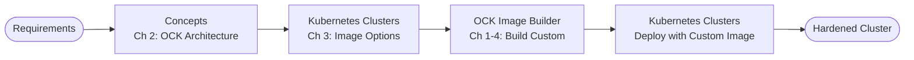

## Overview

The Oracle Cloud Native Environment Release 2 documentation set comprises 9 integrated books designed to support the complete lifecycle of Kubernetes cluster deployment and management. As the technical writer responsible for this documentation set, I designed the information architecture to accommodate four distinct cluster providers (libvirt, OCI, OLVM, BYO), multiple user personas with varying expertise levels, and use cases ranging from quick evaluation to production deployment and ongoing operations.

This portfolio entry documents the architectural decisions, organizational principles, and cross-referencing strategies that create a cohesive documentation experience across the complete documentation set.

## The Documentation Set

The 9 books serve distinct purposes while forming an integrated whole:

| Book | Purpose | Primary Audience |
|------|---------|------------------|
| **Release Notes** | Version-specific updates, CVEs, known issues | All users |
| **Concepts** | Architecture, components, provider comparisons | Architects, evaluators |
| **Quick Start** | Fastest path to running cluster | Developers, new users |
| **CLI Reference** | Complete command syntax and options | All users (reference) |
| **Kubernetes Clusters** | Full deployment and administration | Platform engineers, admins |
| **Applications** | Catalog and application management | DevOps, developers |
| **Kubernetes** | Platform fundamentals | Users new to Kubernetes |
| **OCK Image Builder** | Custom node image creation | Security teams, advanced users |
| **Upgrade Guide** | Release 1.x to Release 2 migration | Existing customers |

## Documentation Set Architecture

The books are organized into five functional categories that reflect how users approach the documentation:

## Information Flow

This diagram shows how users navigate between books based on their needs:

## User Journeys

The information architecture supports several common reader journeys through the documentation set.

### Journey 1: Quick Evaluation

**Persona:** Developer or DevOps engineer evaluating Oracle CNE for a project.

**Goal:** Get a working Kubernetes cluster as fast as possible.

**Path:** Quick Start (complete) → Applications (deploy sample app) → Concepts (optional exploration)

### Journey 2: Production OCI Deployment

**Persona:** Platform engineer deploying production Kubernetes on Oracle Cloud Infrastructure.

**Goal:** Deploy a production-ready, highly-available cluster on OCI.

**Path:** Release Notes → Concepts (OCI architecture) → CLI (installation, OCI config) → Kubernetes Clusters (OCI deployment) → Applications

### Journey 3: Upgrade from Release 1.x

**Persona:** System administrator migrating existing Release 1 clusters to Release 2.

**Goal:** Successfully migrate production clusters with minimal downtime.

**Path:** Release Notes (breaking changes) → Upgrade Guide (prerequisites) → Kubernetes Clusters (backup) → Upgrade Guide (execute, validate) → CLI Reference (new commands)

### Journey 4: Custom Node Images

**Persona:** Security or platform team creating hardened node images.

**Goal:** Build custom OCK images meeting corporate security standards.

**Path:** Concepts (OCK architecture) → Kubernetes Clusters (image options) → OCK Image Builder (build custom) → Kubernetes Clusters (deploy)

### Journey 5: Day-2 Operations

**Persona:** SRE or operations engineer maintaining production clusters.

**Goal:** Ongoing cluster maintenance including updates, scaling, backups, and troubleshooting.

**Pattern:** Kubernetes Clusters Chapter 10 serves as the operations hub, with frequent cross-references to CLI Reference, Release Notes, Kubernetes guide, and Applications.

## Architectural Principles

### Task-Based Organization

Each book focuses on specific user tasks rather than feature-based organization. Users can locate content by what they want to accomplish, not by which product component implements the feature.

### Progressive Disclosure

The documentation set provides layered depth:
- **Quick Start** — Fastest path, minimal explanation
- **Concepts** — Why things work the way they do
- **Kubernetes Clusters** — Complete procedural depth
- **CLI Reference** — Exhaustive detail for every option

### Parallel Structure Across Providers

Chapters 5-8 of Kubernetes Clusters follow identical organization for each provider:
1. Setup
2. Create Cluster
3. Connect
4. Scale
5. Upgrade
6. Delete

This parallel structure allows users to transfer knowledge between providers and simplifies maintenance when procedures change across all providers.

### Separation of Reference and Procedural Content

- Configuration options documented separately from procedures (Chapter 2 vs. Chapters 5-8)
- CLI commands documented in CLI Reference, invoked from task guides
- Enables quick lookup without navigating through procedures

### Multiple Entry Points

Different users enter the documentation set at different points:
- **New users:** Quick Start
- **Evaluators:** Concepts
- **Experienced admins:** Kubernetes Clusters
- **Existing customers:** Release Notes, Upgrade Guide

## Cross-Reference Strategy

Effective cross-referencing ensures users can navigate the complete set without getting lost or hitting dead ends.

### Cross-Reference Matrix

| From | To | Purpose |
|------|-----|---------|
| Release Notes | All guides | Feature details, procedure locations |
| Quick Start | Kubernetes Clusters | Production deployment |
| Concepts | Kubernetes Clusters | Procedural implementation |
| Kubernetes Clusters | CLI Reference | Command syntax |
| Kubernetes Clusters | Applications | Post-deployment |
| Applications | CLI Reference | Catalog commands |
| Kubernetes Clusters | OCK Image Builder | Custom images |
| All guides | Kubernetes | Platform fundamentals |
| Upgrade Guide | Kubernetes Clusters, CLI | Post-upgrade operations |

### Cross-Reference Visualization

The **Kubernetes Clusters** guide serves as the central hub of the documentation set, with the most incoming and outgoing cross-references.

## Documentation Challenges and Solutions

### Challenge 1: Four Provider Models

Oracle CNE supports libvirt, OCI, OLVM, and BYO providers with fundamentally different prerequisites, capabilities, and procedures.

**Solution:** Created provider-agnostic foundational content (Concepts, configuration principles) with provider-specific chapters using parallel structure. Comparison matrices help users choose providers. DITA conditional processing enables shared content where procedures overlap.

### Challenge 2: Multiple Expertise Levels

Users range from Kubernetes novices to experienced platform engineers.

**Solution:** Layered documentation architecture:
- Quick Start for beginners (assumes no Kubernetes knowledge)
- Kubernetes guide for platform fundamentals
- Kubernetes Clusters for experienced administrators
- OCK Image Builder for advanced customization

### Challenge 3: Complete Lifecycle Coverage

Documentation must support initial deployment through ongoing operations and eventual upgrade or migration.

**Solution:** Organized by lifecycle stage with clear pathways:
- **Evaluation:** Quick Start + Concepts
- **Deployment:** Kubernetes Clusters
- **Operations:** Kubernetes Clusters Ch 10 + Applications
- **Migration:** Upgrade Guide

### Challenge 4: Coherence Across 9 Books

Maintaining consistent terminology, cross-references, and organization across nearly 1,000 pages required systematic approach.

**Solution:**
- DITA key definitions for product names, versions, URLs
- Consistent chapter numbering conventions
- Parallel structure patterns (provider chapters)
- Regular cross-reference audits
- Style guide enforcement

## DITA Implementation

### Content Reuse Mechanisms

- **Keydefs:** Product names, version numbers, URLs managed centrally
- **Conrefs:** Shared warnings, prerequisites, and standard notes
- **Conditional Processing:** Provider-specific content filtered using DITAVAL
- **Relationship Tables:** Managed cross-references between books

### Topic Type Strategy

| Type | Usage | Examples |
|------|-------|----------|
| **Concept** | Architecture, design rationale | Provider introductions, configuration concepts |
| **Task** | Step-by-step procedures | Creating clusters, scaling nodes |
| **Reference** | Structured data, options | Configuration file options, CLI syntax |

## Target Audience

This portfolio entry demonstrates:

- **Information architecture design** for complex, multi-deliverable documentation sets
- **User journey mapping** across documentation boundaries
- **Content strategy** for technical products with multiple deployment models
- **DITA XML architecture** for enterprise documentation
- **Cross-reference planning** to create cohesive user experiences
