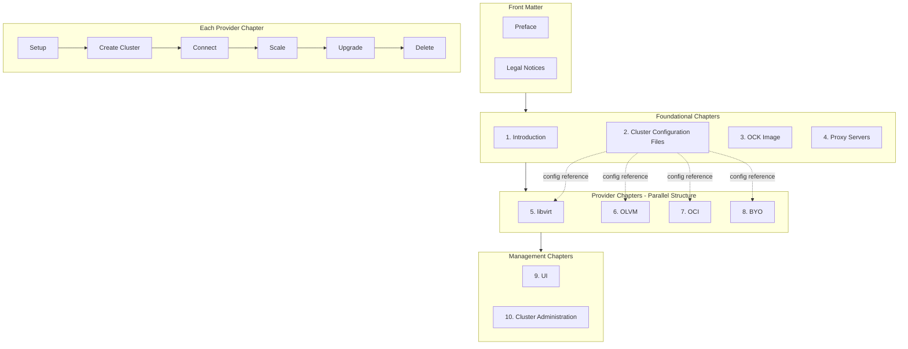

## Overview

The Oracle Cloud Native Environment Kubernetes Clusters Guide is the primary administration reference for Oracle CNE, covering complete procedures for creating, configuring, updating, backing up, and managing Kubernetes clusters across all supported deployment models: libvirt (KVM-based), Oracle Cloud Infrastructure, Oracle Linux Virtualization Manager, and Bring Your Own (bare metal or other platforms).

## Target Audience

System administrators deploying production Kubernetes clusters, platform engineers building cloud-native infrastructure, DevOps teams automating cluster deployment, and site reliability engineers maintaining cluster health. Assumes strong Linux administration skills, networking knowledge, and basic Kubernetes familiarity.

## Key Documentation Features

### Multi-Provider Architecture

One of the most significant challenges was documenting four distinct deployment models while maintaining coherent structure. Each provider has different prerequisites, configuration options, networking considerations, and troubleshooting approaches.

**Solution:** Developed modular documentation with common foundational procedures and provider-specific chapters using parallel structure. Created comparison matrices showing feature availability by provider and extensive cross-references for equivalent operations.

### Production-Ready Focus

Unlike Quick Start documentation, this guide focuses on production deployments including high-availability configurations, security hardening, performance tuning, disaster recovery strategies, and monitoring integration.

### Complete Lifecycle Coverage

- **Creation:** Detailed deployment procedures with all configuration options
- **Configuration:** Post-deployment customization and tuning
- **Updates:** Kubernetes version updates and component upgrades
- **Scaling:** Adding/removing nodes, cluster resizing
- **Backup/Restore:** Data protection and recovery procedures
- **Decommissioning:** Proper cluster shutdown and cleanup

## Documentation Challenges

### Challenge 1: Four Distinct Deployment Models

Each provider represents fundamentally different infrastructure with varying capabilities and limitations.

**Solution:** Created provider-specific sections with parallel structures, allowing users to focus on their deployment model. Developed comprehensive comparison tables and clear feature availability documentation per provider.

### Challenge 2: Configuration Complexity

Oracle CNE supports extensive configuration options through YAML files. Documenting all options, interactions, and use cases required careful organization.

**Solution:** Implemented layered approach—quick examples for common scenarios, complete reference for all options, use-case-driven patterns, and troubleshooting for common errors.

### Challenge 3: Update Procedures

Kubernetes clusters require careful updates to maintain availability and data integrity across multiple scenarios with varying risk profiles.

**Solution:** Developed comprehensive procedures with pre-update validation checklists, step-by-step updates with verification points, rollback procedures for each stage, and provider-specific considerations.

## Technical Approach

### Hands-On Validation

Every procedure was tested across all provider types. Built test clusters for libvirt, OCI, OLVM, and BYO environments. Validated all procedures, captured real output and error messages, and documented provider-specific behaviors.

### Automation Integration

Created Terraform and Ansible automation scripts for rapid test environment provisioning, procedure validation, consistent testing, and support team training. These scripts were later adopted by Oracle Support teams for internal lab environments.

### Engineering Collaboration

Participated in feature design reviews, tested pre-release functionality, provided feedback on usability and documentation needs, and validated technical accuracy with development teams.

## DITA Book Structure

This guide is authored in DITA XML using a bookmap structure, demonstrating modular topic-based authoring principles. The architecture showcases content reuse, conditional processing, and consistent information typing.

### Book Organization

The bookmap contains front matter (preface, legal notices) and 10 chapters organized into logical groupings:

**Foundational Chapters (1-4)**
- Chapter 1: Introduction — Concept topics covering Oracle CNE overview, provider types, configuration hierarchy
- Chapter 2: Cluster Configuration Files — Concept overview plus reference topics for each provider's configuration options (BYO, libvirt, OCI, OLVM) and configuration examples
- Chapter 3: Oracle Container Host for Kubernetes Image — Concept and task topics covering OCK image user, custom images, OSTree archive images
- Chapter 4: Proxy Servers — Task topics for CLI, cluster, and UI proxy configuration

**Provider Chapters (5-8)** — Parallel structure across all four providers
- Chapter 5: libvirt Provider — Setup, cluster creation, connection, deletion
- Chapter 6: Oracle Linux Virtualization Manager Provider — Setup, configuration, image creation, VM templates, cluster operations, scaling, upgrades, deletion (includes oVirt CSI driver reference)
- Chapter 7: OCI Provider — Setup, Cluster API templates, compute images, cluster creation, OCI components reference, scaling, upgrades, deletion
- Chapter 8: Bring Your Own Provider — OS image options (ISO, OSTree), cluster creation, node migration, deletion

**Management Chapters (9-10)**
- Chapter 9: UI — Access tokens, port forwarding, catalog integration
- Chapter 10: Cluster Administration — Updates (patch and minor releases), backups, cluster analysis, OS console access

### Visual Structure

### Topic Types

The guide uses all three core DITA topic types strategically:

| Topic Type | Usage | Examples |
|------------|-------|----------|
| **Concept** | Architectural overview, design rationale, when to use features | Provider introductions, configuration file concepts, update best practices |
| **Task** | Step-by-step procedures with prerequisites and results | Creating clusters, scaling nodes, backing up clusters |
| **Reference** | Structured data, configuration options, specifications | Configuration file options, Cluster API template parameters, CLI command reference |

### Content Reuse Architecture

**Keydefs:** Product names, version numbers, and URLs managed through key definitions for consistent terminology and easy updates across releases.

**Conditional Processing:** Provider-specific content filtered using DITAVAL processing. Common procedures (connecting to clusters, monitoring installations) written once and conditionalized for provider context.

**Conrefs:** Shared content fragments for repeated warnings, prerequisites, and standardized notes reused across chapters.

**Parallel Structure:** Provider chapters (5-8) follow identical organizational patterns, enabling users to transfer knowledge between providers and simplifying maintenance when procedures change.

### Information Architecture Decisions

**Separation of Concerns:** Configuration reference content (Chapter 2) separated from procedural content (Chapters 5-8), allowing users to reference options without navigating through procedures.

**Progressive Disclosure:** Each provider chapter follows setup → creation → operation → maintenance → deletion flow, matching the user's journey through the cluster lifecycle.

**Nested Topics:** Complex operations use nested topic structures. For example, the OCI Provider chapter contains sub-topics for Cluster API templates, compute images, and scaling operations, each with their own concept/task/reference breakdown.

### User Flows

The documentation architecture supports several common reader journeys:

**Flow 1: First-Time OCI Deployment**
1. Chapter 1 (Introduction) — Understand provider options, choose OCI
2. Chapter 2 (Configuration Files) — Review OCI-specific configuration options
3. Chapter 3 (OCK Image) — Learn about node images
4. Chapter 7 (OCI Provider) — Follow setup, create cluster, connect

**Flow 2: Scaling an Existing OLVM Cluster**
1. Chapter 6 (OLVM Provider) — Navigate directly to "Scale a Cluster" section
2. Chapter 2 (Configuration Files) — Reference OLVM options if needed
3. Chapter 10 (Cluster Administration) — Review best practices

**Flow 3: Production Hardening**
1. Chapter 1 (Introduction) — Review high-availability concepts
2. Chapter 2 (Configuration Files) — Find security-related options
3. Provider chapter (5-8) — Apply provider-specific configurations
4. Chapter 10 (Cluster Administration) — Set up backups, monitoring

**Flow 4: Upgrading Kubernetes Version**
1. Chapter 10 (Cluster Administration) — Read update best practices
2. Provider chapter (5-8) — Follow provider-specific upgrade procedure
3. Chapter 2 (Configuration Files) — Verify configuration compatibility

These flows demonstrate how the parallel provider structure and separated reference content allow users to efficiently navigate based on their specific task and deployment model.
